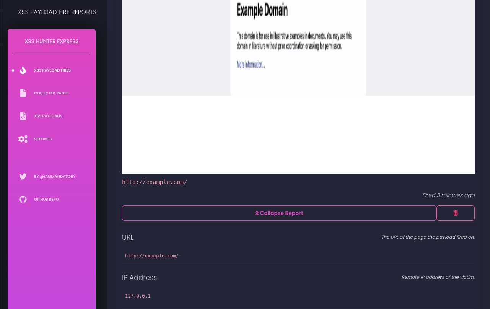
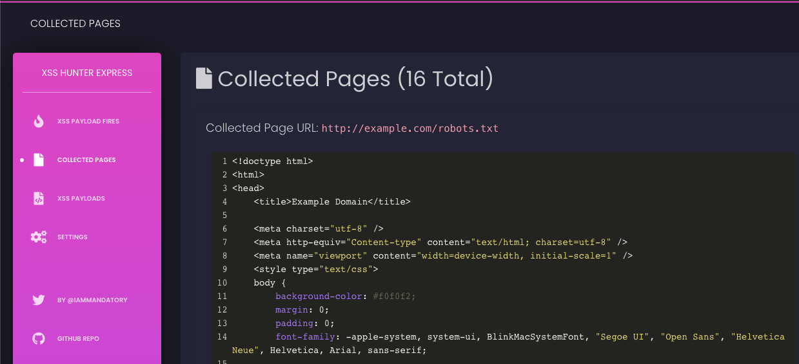
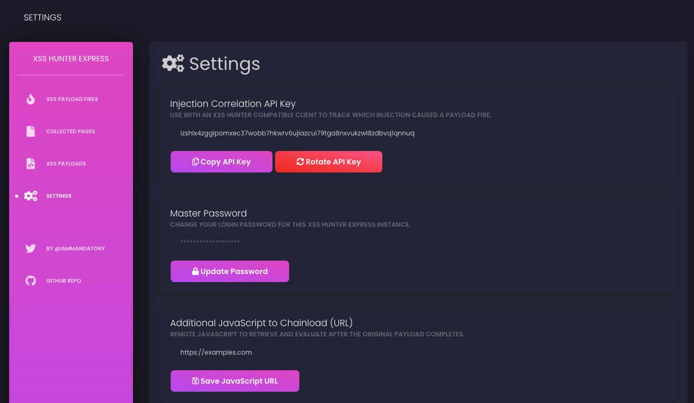
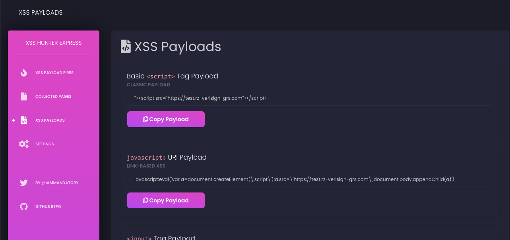

# XSS Hunter Express
## *Sets up in 5 minutes and requires no maintenance*

The fastest way to set up XSS Hunter to test and find blind cross-site scripting vulnerabilities.

## Setup (Five minutes, try not to skim too much)

### Requirements
* `docker` and `docker-compose` installed
* Host with at least 2 GB of RAM
* A hostname (e.g. `host.example.com`) which you can map to your server's IP (have DNS control for)
* *[For Email Notifications]* To receive email notifications of XSS payload fires you'll need an email account with valid SMTP credentials. You can use many regular email accounts like Gmail for this purpose. This is not required if you don't want email notifications.

### Configuring Your Instance
To set up XSS Hunter Express, modify the [`docker-compose.yaml`](https://github.com/mandatoryprogrammer/xsshunter-express/blob/main/docker-compose.yml) file with your appropriate settings/passwords/etc.

The following are some YAML fields (in [`docker-compose.yaml`](https://github.com/mandatoryprogrammer/xsshunter-express/blob/main/docker-compose.yml)) you'll need to modify before starting the service:

* `HOSTNAME`: Set this field to your hostname you want to use for your payloads and to access the web admin panel. Often this is as short as possible (e.g. `xss.ht`) so the payload can be fit into various fields for testing. This hostname should be mapped to the IP address of your instance (via a DNS `A` record).
* `GREENLOCK_SSL_ENABLED`: Set this field to true for default SSL setup threw greenlock. Set false if you know what don't want it
* `SSL_CONTACT_EMAIL`: In order to automatically set up and renew TLS/SSL certificates via [Let's Encrypt](https://letsencrypt.org/) you'll need to provide an email address.

The following are needed if you want email notifications:

* `SMTP_EMAIL_NOTIFICATIONS_ENABLED`: Leave enabled to receive email notifications (you must set this up via the below configurations as well).
*  `SMTP_HOST`: The host of your SMTP server where your email account is hosted (e.g. `smtp.gmail.com`).
* `SMTP_PORT`: The port of your SMTP server (e.g. `465`).
* `SMTP_USE_TLS`: Utilize TLS if your SMTP server supports it.
* `SMTP_USERNAME`: The username of the email account on your SMTP server (e.g. `exampleuser`).
* `SMTP_PASSWORD`: The password of the email account on your SMTP server (e.g. `Password1!`).
* `SMTP_FROM_EMAIL`: The email address of your email account on the SMTP server (e.g. `exampleuser@gmail.com`).
* `SMTP_RECEIVER_EMAIL`: What email the notifications will be sent to. This may be the same as the above but could be different.

The following are needed if you want slack notifications:

* `SLACK_NOTIFICATIONS_ENABLED`: Leave enabled to receive slack notifications (you must set this up via the below configurations as well).
* `SLACK_WEBHOOK`: The slack webhook that you get once you setup integration.
* `SLACK_CHANNEL`: The slack channel that the webhook will post to.
* `SLACK_USERNAME`: The username given to the slack message (e.g. `XSS Hunter Alerts`).
* `SLACK_EMOJI`: The Emoji used as the porfile picture on slack (e.g. `warning`).

The following are needed if you want discord notifications:

* `DISCORD_NOTIFICATIONS_ENABLED`: Leave enabled to receive discord notifications (you must set this up via the below configurations as well).
* `DISCORD_WEBHOOK`: The discord webhook that you get once you setup integration.

Finally, the following is worth considering for the security conscious:

* `CONTROL_PANEL_ENABLED`: If you want to minimize the attack surface of your instance you can disable the web control panel. This makes it so you'll only receive emails of payload fires (results will still be stored on disk and in the database).


### Build & Start XSS Hunter Express

Once you've set it up, simply run the following commands to set up the service:

```bash
# Change into the repo directory
cd xsshunter-express/
# Start up postgres in the background
docker-compose up -d postgresdb
# Start up the service
docker-compose up xsshunterexpress
```

Assuming all has gone well, you'll see an admin password printed onto your screen. Use this to log into the web panel now hosted at `https://your-hostname.com/admin/`.

**NOTE**: The very first HTTP request to your instance will be slow due to the fact that the service will automatically generate a TLS/SSL certificate. This should only take ~15 seconds.

## Features
* **Managed XSS payload fires**: Manage all of your XSS payloads in your XSS Hunter account's control panel.
* **Powerful XSS Probes**: The following information is collected everytime a probe fires on a vulnerable page:
    * The vulnerable page's URI 
    * Origin of Execution 
    * The Victim's IP Address 
    * The Page Referer 
    * The Victim's User Agent 
    * All Non-HTTP-Only Cookies 
    * The Page's Full HTML DOM 
    * Full Screenshot of the Affected Page 
    * Responsible HTTP Request (If an XSS Hunter compatible injection tool is used)
    * Browser's reported time
    * If the payload was fired in an iframe 
* **Fully Dockerized**: Modify the config with your custom settings and launch with a single command!
* **Automagically TLS/SSL Setup & Renewal**: Just create the proper DNS records and XSS Hunter Express with automatically utilize LetsEncrypt to set up and renew the appropriate TLS/SSL certificates.
* **`gzip`-Compressed Payload Fire Images**: All images are stored with `gzip` compression to utilize less hard disk space on your instance.
* **Minimize Attack Surface**: Optionally disable the web UI altogether to minimize the attack surface of your instance.
* **Full Page Screenshots**: XSS Hunter probes utilize the HTML5 canvas API to generate a full screenshot of the vulnerable page which an XSS payload has fired on. With this feature you can peak into internal administrative panels, support desks, logging systems, and other internal web apps. This allows for more powerful reports that show the full impact of the vulnerability to your client or bug bounty program.
* **XSS Payload Fire Email Reports**: XSS payload fires also send out detailed email reports which can be easily forwarded to the appropriate security contacts for easy reporting of critical bugs.
* **Automatic Payload Generation**: XSS Hunter automatically generates XSS payloads for you to use in your web application security testing.
* **Correlated Injections**: Perhaps the most powerful feature of XSS Hunter is the ability to correlated injection attempts with XSS payload fires. By using an [XSS Hunter compatible testing tool](https://github.com/mandatoryprogrammer/xsshunter_client) you can know immediately what caused a specific payload to fire (even weeks after the injection attempt was made!).
* **Page Grabbing**: Upon your XSS payload firing you can specify a list of relative paths for the payload to automatically retrieve and store. This is useful in finding other vulnerabilities such as bad `crossdomain.xml` policies on internal systems which normally couldn't be accessed.
* **Secondary Payload Loading**: Got a secondary payload that you want to load after XSS Hunter has done it's thing? XSS Hunter offers you the option to specify a secondary JavaScript payload to run after it's completed it's collection.
* **Mobile Compatible**: Check your payloads at the bar without your laptop, the web interface is fully mobile ready.

## Screenshots






## Credits

* The front-end is built in Vue and utilizes the [`vue-black-dashboard`](https://github.com/creativetimofficial/vue-black-dashboard) framework. Licensed under MIT (see [https://github.com/creativetimofficial/vue-black-dashboard#licensing](https://github.com/creativetimofficial/vue-black-dashboard#licensing)).

## Security Vulnerabilities

Find a security vulnerability in this service? Nice job! Please email me at `mandatory(at)gmail.com` and I'll try to fix it as soon as possible.